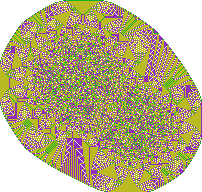
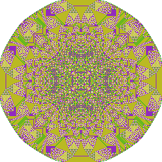
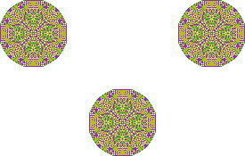

# Abelian sandpile model

Утилита для моделирования [абелевой песчаной кучи](https://en.wikipedia.org/wiki/Abelian_sandpile_model) и сохранения результатов в формате BMP.

## Сборка
Для сборки необходим CMake 3.5.0+ и компилятор с поддержкой C++23. Собрать можно командой:
```bash
cmake -B ./build & cmake --build ./build
```

## Использование
Результат работы программы — одно или несколько изображений в формате BMP, каждое из которых содержит минимальный по размерам прямоугольник, содержащий все непустые ячейки.

### Задание начального состояния
Для использования необходимо создать файл в формате `.tsv`, в котором будет описываться начальное состояние модели в формате:
```
<x1>    <y1>    <grains1>
<x2>    <y2>    <grains2>
...
```
То есть описывается, сколько песчинок будет в ячейке на каждой координате. Если ячейка не указана, считается, что в ней 0 песчинок.
Если файл содержит ошибки (несоответствие формату, невозможно спарсить число и т. д.), то утилита не начнёт работу.

Координаты могут быть отрицательными, единственное ограничение — входят в `int16_t` (то есть от -65536 до 65535).
Количество песчинок — целое неотрицательное число в диапазоне `uint64_t` (то есть от 0 до 18446744073709551615).

### Список команд
| Короткий аргумент | Длинный аргумент              | Значение по умолчанию   | Описание |
|-------------------|-------------------------------|-------------------------|----------|
| `-o path`         | `--output=path`               |                         | Путь к директории, в которую будут записаны состояния модели в формате BMP. |
| `-i path`         | `--input=path`                |                         | Путь к `.tsv` файлу с описанием начального состояния. |
| `-f n`            | `--freq=n`                    | `0`                     | Частота вывода промежуточных состояний. |
| `-m n`            | `--max-iter=n`                | `0`                     | Максимальное количество итераций модели (обвалов). |
| `-p prefix`       | `--output-prefix=prefix`      | `sandpile_`             | Префикс имён выходных файлов. |
| `-e ext`          | `--output-extension=ext`      | `.bmp`                  | Расширение выходных файлов (влияет только на имя). |
| `-h`              | `--help`                      |                         | Игнорировать остальные команды и показать справку

### Выходные файлы
Каждая промежуточная итерация сохраняется в BMP файл с именем `<output-prefix><iteration><extension>`, что по умолчанию выглядит как `sandpile_<iteration>.bmp`.

Финальное состояние сохраняется в формате `<output-prefix>final<extension>`, и по умолчанию: `sandpile_final.bmp`.

BMP файл использует всего 5 цветов в зависимости от количества песчинок в ячейке (1 ячейка = 1 пиксель):
* 0 - белый (255, 255, 255)
* 1 - зеленый (20, 181, 31)
* 2 - фиолетовый (146, 42, 191)
* 3 - желтый (186, 186, 34)
* \> 3 - черный (0, 0, 0)

## Итерации модели
Если указаны `--freq` или `--max-iter`, то под итерацией модели понимается 1 обвал всех ячеек по очереди. Обвал 1 ячейки — если в ячейке более 3 песчинок, то по 1 песчинке перемещается в соседние по ребру клетки ячейки.

Если ни один из этих параметров не указан, то есть нужен только финальный результат (стабильная куча), то обвалы производятся иначе: каждая ячейка обваливается до конца (пока в ней не станет меньше 4 песчинок). Финальный результат не меняется благодаря математическим свойствам модели, но количество обвалов снижается в несколько раз.

## Примеры работы
```tsv
0	0	10000
10	10	14000
-50	50	43000
```



```tsv
0	0	100000
```



```tsv
0	0	10000
100	100	10000
-100	100	10000
```



## Примечания
Эта лабораторная работа была призвана познакомить с динамической памятью и с бинарными форматами на примере BMP (также заставив самостоятельно в этом формате разобраться).

Здесь есть большой простор для оптимизации, и по времени, и по памяти, однако я ограничился базовым вариантом.

Стандартные контейнеры были запрещены.

* [Оригинальное задание](task.md)
